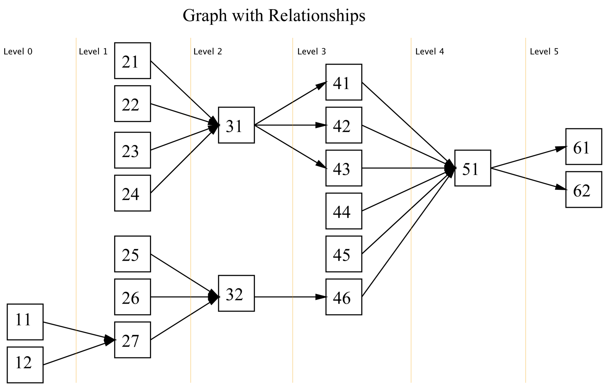

# Dependency Graph

## Introduction
This library will help **navigate** a directed acyclic graph (DAG).

The goal of this library is to make it easy to:

- Find a specific node within a graph.
- Find all nodes on a certain level of the graph.
- Find all nodes between two levels of the graph.
- Find all nodes related to a given node. (i.e. find its decedents and/or its precedents on any level of the graph.)
- Sort the nodes in topological order

## Naming Convention
- Descendant. i.e. What descends from or comes after: Child
- Precedents. i.e What precedes, or comes before: Parent

## Interface

### Graph

``` C#
    public interface IGraph<T>
        where T : IEquatable<T>
    {
        INode<T> Find(T value); 

        void AddSequence(IEnumerable<T> sequence);
        void AddSequences(IEnumerable<IEnumerable<T>> sequences);

        IEnumerable<INode<T>> Nodes { get; }

        bool CanSort();
        bool CanSort(IEnumerable<T> sequence);

        int CountNodes { get; }
        int CountLevels { get; }
        IOrderedEnumerable<INode<T>> GetNodes(int level);
        IOrderedEnumerable<INode<T>> GetNodesBetween(int levelFrom, int levelTo);
        IOrderedEnumerable<INode<T>> Sort();
    }
```

**Note:**

- ```AddSequence(IEnumerable<T> sequence)```: the sequence must contain at least 2 items. The relationship between the items is automatically assumed as item1 -> item2 -> item3 etc...

### Node

``` C#
    public interface INode<T>
        where T: IEquatable<T>
    {
        T Value { get; }
        IGraph<T> Graph { get; }
        int Level { get; }

        // relativeLevel >= relativeLevelFrom && relativeLevel <= relativeLevelTo
        IOrderedEnumerable<INode<T>> GetNeighbours(int relativeLevelFrom, int relativeLevelTo);
        // relativeLevel < 0
        IOrderedEnumerable<INode<T>> Precedents { get; }
        // relativeLevel > 0
        IOrderedEnumerable<INode<T>> Descendants { get; }
        // relativeLevel == relativeLevel - 1
        IOrderedEnumerable<INode<T>> ImmediatePrecedents { get; }
        // relativeLevel == relativeLevel + 1
        IOrderedEnumerable<INode<T>> ImmediateDescendants { get; }
        // Precedents of the node without precedents (roots)
        IOrderedEnumerable<INode<T>> TerminatingPrecedents { get; }
        // Descendants of the node without descendants (leafs)
        IOrderedEnumerable<INode<T>> TerminatingDescendants { get; }
    }
```

**Note:**
- All the methods return an ordered enumerable of INode. The ordering is based on the "level" of the node. (Within a level the ordering is not important.)
- If possible the methods should return all the INodes lazily.
- A Node object has a reference to the Graph object.


## Algorithms, Time Complexity

The Dependency Graph is a **static** data structure. All the nodes and their relationships should be known ahead of time.

| Method Names| Algorithms | Time Complexity |
|-------------|------------|-----------------|
|AddSequence()|-|O(1) |
|AddSequences()|-|O(1) |
|Sort()|[Topological Sort](http://en.wikipedia.org/wiki/Topological_sorting)|O(V+E) |
|CanSort()|[Topological Sort](http://en.wikipedia.org/wiki/Topological_sorting)|O(V+E) |
|ComputeLevels()|[Critical Path](http://en.wikipedia.org/wiki/Critical_path_method), [DFS](http://en.wikipedia.org/wiki/Depth-first_search)|O(E+V) |
|CountNodes()|-|O(1) |
|CountLevels()|-|O(1) |
|GetNodesWithLevel()|[DFS](http://en.wikipedia.org/wiki/Depth-first_search)|O(V+E) |
|GetNodesWithLevelBetween()|[DFS](http://en.wikipedia.org/wiki/Depth-first_search)|O(V+E) |
|Precedents()|[DFS](http://en.wikipedia.org/wiki/Depth-first_search)|O(V+E) |
|Descendants()|[DFS](http://en.wikipedia.org/wiki/Depth-first_search)|O(V+E) |
|ImmediatePrecedents()|[DFS](http://en.wikipedia.org/wiki/Depth-first_search)|O(V+E) |
|ImmediateDescendants()|[DFS](http://en.wikipedia.org/wiki/Depth-first_search)|O(V+E) |
|TerminatingPrecedents()|[DFS](http://en.wikipedia.org/wiki/Depth-first_search)|O(V+E) |
|TerminatingDescendants()|[DFS](http://en.wikipedia.org/wiki/Depth-first_search)|O(V+E) |

##### ComputeLevels private method

ComputeLevels method performs initial pre-calculation (e.g. pre-calculate levels for nodes)
Graph will be rebuild automatically on first call of any method related to node levels after a graph structure change.

1. Find the longest path. 
Critical path method O(V+E)
2. DFS from the source of the longest path, decrementing the level value for every child	DFS - O(V+E)

## Example



#####NOTE:
- The root nodes are 11 and 12.
- This graph has 6 levels. (The root nodes have a level value equal to 0. In this example it corresponds to Level1. i.e. Level1's level = 0)
- Level1 contains nodes 11, 12. Level2 contains nodes 21, 22, 23, 24, 25, 26, 27

### Create Graph Structure

```C#
	new Graph(new []
	{
		new[] {51, 61},
		new[] {51, 62},
		// etc....
	});
```

Or

```C#
    var graph = new Graph();
    graph.AddRange(new []
    {
        new[] {51, 61},
        new[] {51, 62},
		// etc....
    });
```

### Interaction

```C#
	[Test]
	public void BasicOperationsTest()
	{
		var graph = CreateExampleGraph();

		Assert.IsTrue(graph.CanSort());

		Assert.AreEqual(20, graph.Count);

		Assert.IsTrue(graph.CanSort());
			
		Assert.AreEqual(6, graph.CountLevels);
            
		AssertCollectionsConsistsOfNodes(new[] {31}, graph.GetNodes(4));

		AssertCollectionsConsistsOfNodes(new[] {51, 61, 62}, graph.GetNodesBetween(4, 5));

		AssertCollectionsConsistsOfNodes(new[] {11, 12, 25, 26, 27}, graph.Find(32).Precedents);

		AssertCollectionsConsistsOfNodes(new[] {51, 61, 62}, graph.Find(43).Descendants);

		AssertCollectionsConsistsOfNodes(new[] {25, 26, 27}, graph.Find(32).ImmediatePrecedents);

		AssertCollectionsConsistsOfNodes(new[] {51}, graph.Find(43).ImmediateDescendants);

		AssertCollectionsConsistsOfNodes(new[] {11, 12}, graph.Find(32).TerminatingPrecedents);

		AssertCollectionsConsistsOfNodes(new[] {61, 62}, graph.Find(43).TerminatingDescendants);
	}
```

## Things To Think About

- How to return all nodes between two levels that relate to a certain node.

```C#
	GetNodesRelatedTo(T value, int minLevel == 0, int maxLevel == max)

	graph.GetNodesRelatedTo(11, 1, 3) => new[]{27, 32, 46}
	graph.GetNodesRelatedTo(32, 0, 3) => new[]{11, 12, 25, 26, 27, 32, 46}
```

- Node.GetNext()
- Node.GetPrevious()

## POIs

- There are some ways how we can improve CanSort(sequence) method:
 - We can copy graph much faster if we will find relations using temporary array and node.Key.
 - We can track changes, which were made to graph and UnDo them after the sorting.
- We can re-implement Compute Level algorithm with an idea of Relative Node.

## Links

- http://msdn.microsoft.com/en-us/library/ms379574(v=vs.80).aspx
- http://www.geeksforgeeks.org/find-longest-path-directed-acyclic-graph/
- http://en.wikipedia.org/wiki/Longest_path_problem
- http://en.wikipedia.org/wiki/Critical_path_method